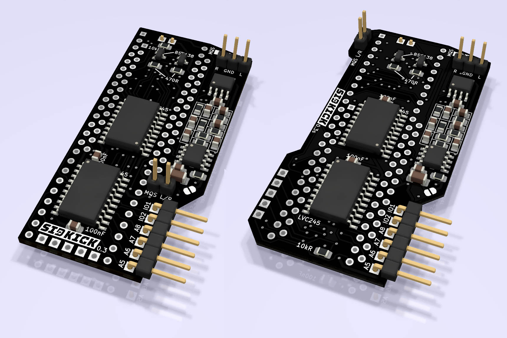
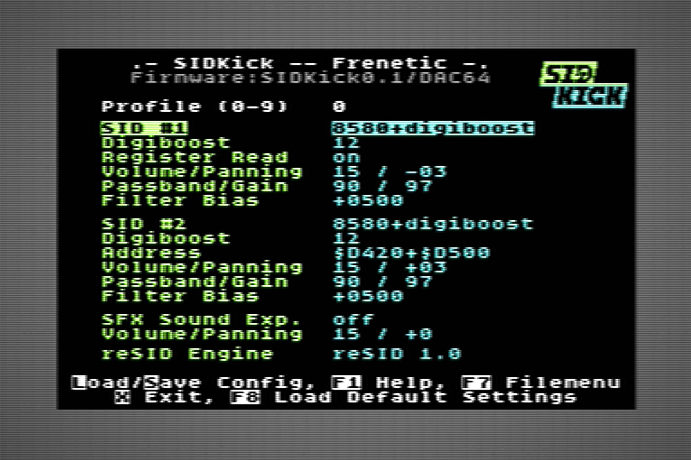
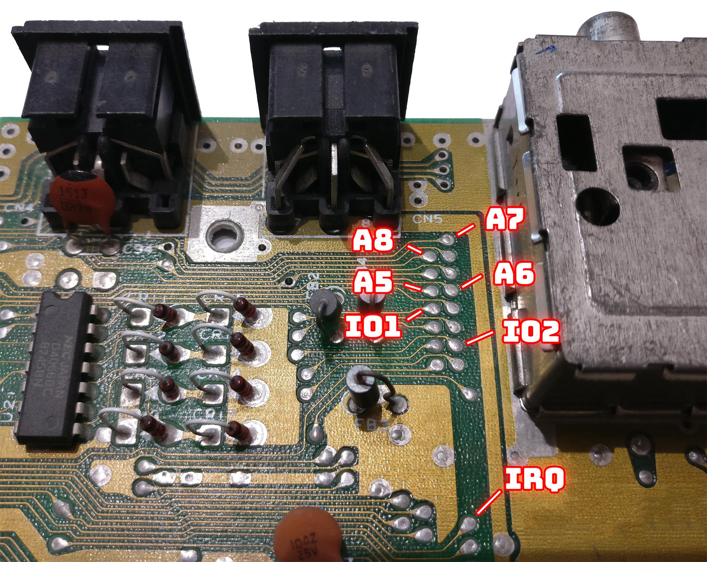
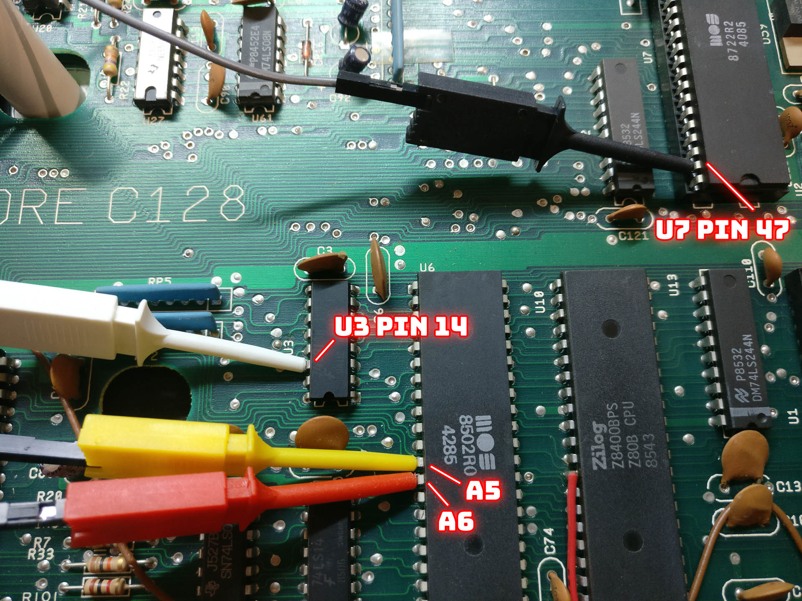
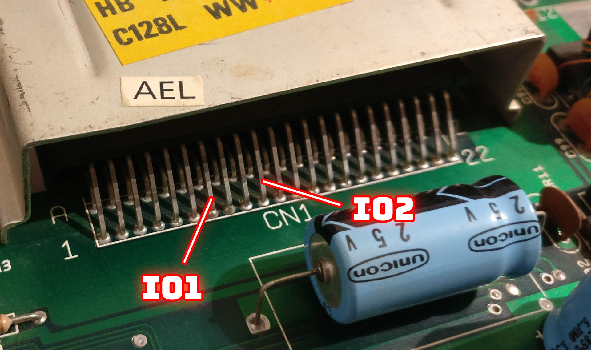
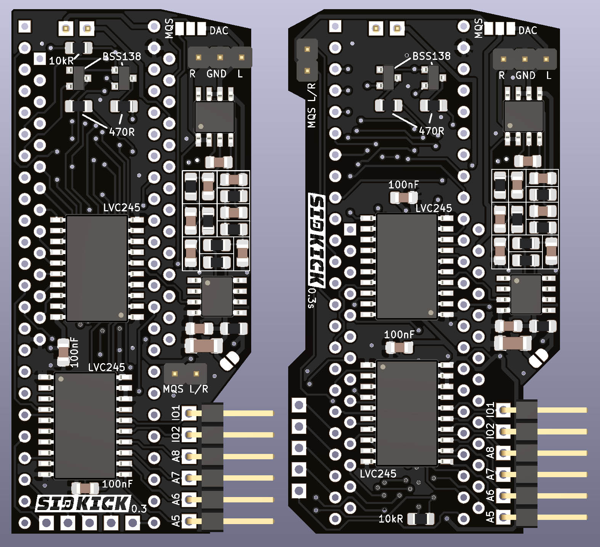

    
  <b> .- the only complete SID-drop-in-replacement that you can build yourself -. </b>  

SIDKick is a drop-in replacement for the SID 6581 and 8580 used in C64s and C128s based on a Teensy 4.1. 
It emulates two SIDs and a Sound Expander/FM at the same time. It makes no compromises with regard to quality: the emulation is based on reSID and fmOPL. It also comes with a few extras.

Currently its features include:
-	6581 and/or 8580 emulation based on reSID 0.16 or reSID 1.0 (configurable)
-	2nd-SID address at $d400, $d420, $d500, $d420 + $d500 simultaneously, $de00, $df00
-	Sound Expander/FM emulation based on fmOPL (at $df00)
-	paddle/mouse support
-	built-in configuration menu (launch with "SYS 54301")
-	built-in PRG launcher (via menu)
-	10 different profiles, switchable on-the-fly via an optional button (otherwise via menu), "SAM" will tell you which you selected
-	sound output via Teensy MQS (PWM) or high-quality using a PT8211/TM8211-DAC, filters, and an operational amplifier
-	output available at connectors (stereo) or routed through the mainboard (mono)

    

## How to build a SIDKick:

There are two versions of the PCB which differ only in the placement of components: for C64 longboards (v0.3, left) and C64 shortboards (v0.3s, right).
I prepared the latter as the SIDKick+Teensy combination otherwise barely fits below the keyboard in flat C64c cases unless you use low-profile sockets and pin headers. 

Both versions fit into a C128; installing in a C128D requires removing and standoff below the power supply and gently lifting it (same as with other dual SID options).

As I only own PAL machines, I have not tested SIDKick in any NTSC C64 or C128. It should work fine if the clock frequency in the firmware code is set accordingly.

Here you can find the BOM and assembly information for
[SIDKick v0.3](https://htmlpreview.github.io/?https://github.com/frntc/SIDKick/blob/main/BOM/BOM_SIDKick_v03.html) and
[SIDKick v0.3s](https://htmlpreview.github.io/?https://github.com/frntc/SIDKick/blob/main/BOM/BOM_SIDKick_v03s.html) 
Note: if you plan to use the MQS-output only, you can skip all SMD-parts outside of the SID-/Teensy-sockets.

## Firmware Building and Uploading:

Pre-build binaries are available in the release package. Read on for flashing and patching.

The firmware is built with [Teensyduino](https://www.pjrc.com/teensy/teensyduino.html). Note that there are two defines in the code which need to be set properly: compiling the firmware for C128 (#define FIRMWARE_C128), and choosing the output (MQS vs. DAC, #define audioDevice). The compile settings are: "Board: Teensy 4.1", "CPU-Speed: 816 MHz", and "Optimize: Fastest". You can use lower clock frequencies (600 MHz, 720 MHz) when adjusting TEENSY_CLOCK in the code (816 MHz has been tested most, at lower speeds the emulation might not be cycle exact). 

You can upload the firmware directly from the Arduino IDE or use the Teensyloader to flash hex-files. To upload the firmware you need to connect the Teensy to your PC using USB. 

IMPORTANT: if the SIDKick is already installed you must not close the power-from-mainboard jumper (see below) and connect USB at the same time – unless you followed these [instructions](https://www.pjrc.com/teensy/external_power.html).

There is a second Teensyduino-sketch (SIDKickEEPROM) which initializes the SIDKick-configuration stored in the EEPROM of the Teensy.

I made a very simple (and not very comfortable to use) command-line tool to patch the hex-file. Patching is required if you want to add PRGs to the menu launcher. I provide a batch file for Windows, a script for Linux users, and an example PRG-list. Upload the patched firmware afterwards using the Teensyloader.

### Recommended Procedure: 
-	flash and run SIDKickEEPROM
-	optional: patch SIDKick firmware
-	flash SIDKick firmware
-	install SIDKick into your Commodore as decribed below

## Installing SIDKick:

Pay attention to correctly insert the Teensy and the SIDKick as a whole (see backside of PCB for markings) into the SID-socket of your C64 or C128.

You can choose to only emulate a single SID. If you want to use a second SID, or FM emulation, you need to connect additional cables to get the signals to the SIDKick as they are not available at the SID socket:

### Installing additional cables in C64
| SIDKick pin  | C64 |
|----------|:-------------|
| A5 | CPU Pin 12 (required for $d420 and FM) | 
| A6 | CPU Pin 13 (required for FM) | 
| A7 | CPU Pin 14 (optional) | 
| A8 | CPU Pin 15 (required for $d500) | 
| IO1/2 | expansion port pin 7 and 10 $de00 and $df00 addresses | 

### Installing additional cables in C128
| SIDKick pin  | C128 |
|----------|:-------------|
| A5 |  CPU Pin 12 (required for $d420 and FM) | 
| A6 |  CPU Pin 13 (required for FM) |  
| A7 |  MMU (U7, MOS 8722) pin 47 (required for $d500) | 
| A8 |  U3 pin 14 (required for $d500) | 
| IO1/2 |  expansion port pin 7 and 10 $de00 and $df00 addresses |

The photographs show various locations where these signals can be tapped, e.g. A5 and A8 are conveniently available on the mainboards (see photo of ASSY 250469) and at the ROMs (not shown on the photos: on the 250469 at the kernal ROM 251913 at pin 5 and 29).

 
  
  
  

 
### Audio Output

Lastly you need to choose how to output the sound (recall that the firmware determines whether MQS or DAC output is used). You can either use the solder jumper (labelled "MQS DAC" and connect the left-center or center-right to route mono-audio through the mainboard. The better option is to take the output from the pins labelled R GND L (for DAC) or MQS L/R and GNG (for MQS).

### Powering the SIDKick
In principle you can power the Teensy from USB, but the USB-connection is only needed for development. SIDKick can be powered from the main board by either closing the solder-jumper or the pin-jumper (close to Teensy pin 1).

### Profile-Selection-Button (optional)
There are 5 pads for future extensions. The second from right (from top, on the shortboard version) is currently used to add a push button for switching profiles. You can add a button which pulls this line using a pull-down resistor to ground.

## More on the Firmware

The handling of the communication and emulation is pretty much the same as in my [Sidekick64](https://github.com/frntc/Sidekick64)-project  and earlier experiments (e.g. on paddle/mouse handling) in this framework.

The Teensy is powerful enough to handle the communication and reSID 0.16 and fmOPL. However, reSID 1.0 does not work out of the box: it initializes its filter emulation by precomputing lookup tables (taking too long for instant-on) which exceed the Teensy’s available memory. I have modified reSID 1.0 to work with offline-precomputed tables which can be stored in the flash memory of the Teensy.

I also had to modify the Teensy audio library to provide a polling-like mode: the reason being that the communication with the C64/C128 is handled by an interrupt with is triggered every clock cycle – and this conflicts with the standard handling of audio output.

## Disclaimer

Be careful not to damage your Teensy, PC, or Commodore, or anything attached to it. I am not responsible if you or your hardware gets damaged. Keep in mind that the Teensy is typically overclocked. If you don't know what you're doing, better don't... use everything at your own risk.

## License

My portions of the source code are work licensed under GPLv3.
The PCBs are work licensed under a Creative Commons Attribution-NonCommercial-ShareAlike 4.0 International License.

## Misc

Last but not least I would like to thank a few people and give proper credits:
toms01 for making me start this project and intensive testing; androSID for hinting to the opamp; emulaThor and bigby for even more testing and extensive feedback. [Retrofan](https://compidiaries.wordpress.com/) for the SIDKick-logo and his font which is used in the configuration tool. And of course, the authors of reSID and the OPL emulation. 

There have been previous attempts of making drop-in replacements based on a Teensy which deserve being mentioned, e.g. [Teensy-reSID](https://github.com/FrankBoesing/Teensy-reSID) and [6581-SID-teensy](https://github.com/kokotisp/6581-SID-teensy). However, both are far from a complete replacement, and, for various reasons, were not suitable as a basis for SIDKick.

## Trademarks

Teensy is a trademark of PJRC.COM LLC.
